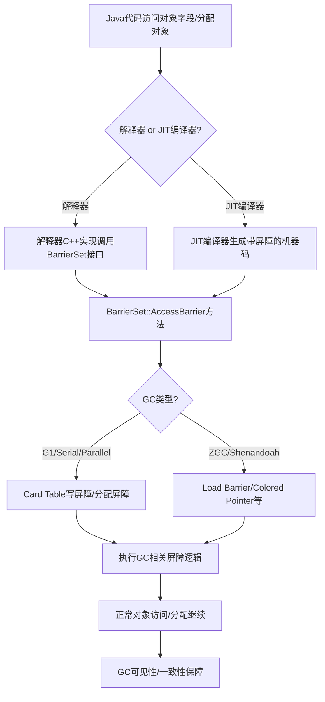

# BarrierSet机制与GC屏障实现详解

## 1. BarrierSet 的功能与作用

- BarrierSet 是 HotSpot JVM 垃圾回收子系统的核心抽象，负责为不同 GC 实现提供统一的屏障（Barrier）接口。
- 主要用于对象访问、分配、线程生命周期等路径插入 GC 相关的屏障逻辑，屏蔽上层代码对具体 GC 的感知。

### 主要功能
- 对象访问屏障（读/写屏障）
- 分配屏障
- 线程生命周期屏障
- 支持编译器生成屏障代码
- 辅助并发/增量 GC 的特殊需求

---

## 2. 典型使用场景

1. **对象字段读写**：所有堆对象的读写都通过 BarrierSet 的接口，GC 可在此插入写屏障、读屏障等逻辑。
2. **对象分配**：在TLAB外分配对象时，BarrierSet可执行分配相关的屏障操作。
3. **GC并发/增量收集**：如G1、Shenandoah、ZGC等需要在对象访问时维护元数据或执行转发。
4. **线程生命周期管理**：线程创建、销毁、挂载、卸载时，BarrierSet可执行GC相关的初始化和清理。
5. **编译器后端支持**：JIT编译器在生成代码时，会调用BarrierSet相关接口，插入必要的屏障指令。

---

## 3. BarrierSet在GC实现中的使用细节

- 不同GC实现（如G1、Shenandoah、ZGC、Serial、Parallel）会继承BarrierSet，实现各自的屏障逻辑。
- JVM通过全局指针动态绑定当前GC的BarrierSet实现。
- 典型细节：
  - **写屏障**：维护记忆集（如card table），支持分代/并发GC。
  - **读屏障**：支持并发/增量GC的对象转发、染色等。
  - **分配屏障**：对象分配时执行特定GC操作。
  - **线程生命周期屏障**：注册/注销线程本地数据、栈根等。
  - **并发/增量GC特有屏障**：如G1的SATB、Shenandoah/ZGC的load barrier。
- 编译器会在生成代码时自动插入屏障指令。

---

## 4. BarrierSet的插入机制

- **解释器**：在C++实现的解释器代码中显式调用BarrierSet接口。
- **JIT编译器**：在生成本地机器码时，调用BarrierSet的相关接口，自动插入屏障指令。
- **对象访问API统一封装**：如`oopDesc::obj_field_put`、`HeapAccess`、`Access`等，底层都会调用BarrierSet接口，保证所有访问路径都能自动插入屏障。
- **可扩展性**：新增GC时，只需实现自己的BarrierSet子类并注册，所有对象访问路径自动支持新GC的屏障。

---

## 5. BarrierSet执行流程图

---

## 6. BarrierSet与volatile的关系

- `volatile` 关键字的语义（可见性、有序性）**不是通过 BarrierSet 实现的**，而是通过底层的内存屏障（memory barrier）/原子操作在 JVM 和硬件层面实现的。
- BarrierSet 主要用于 GC 屏障（如 card table、load barrier、store barrier），不负责 Java 语言级别的并发语义。
- `volatile` 相关操作由 `OrderAccess`、`Atomic` 等底层原语实现，JIT/解释器会在读写 volatile 字段时插入合适的内存屏障指令。

---

## 7. 相关源码入口

- `src/hotspot/share/gc/shared/barrierSet.hpp/cpp`
- `src/hotspot/share/gc/g1/g1BarrierSet.hpp/cpp`
- `src/hotspot/share/gc/shenandoah/shenandoahBarrierSet.hpp/cpp`
- `src/hotspot/share/gc/z/zBarrierSet.hpp/cpp`
- `src/hotspot/share/oops/access.hpp`（统一的对象访问API，底层调用BarrierSet）
- `src/hotspot/share/runtime/orderAccess.hpp/cpp`、`atomic.hpp/cpp`（volatile相关）

---

如需某一具体GC下的屏障实现细节或源码解读，请进一步说明！