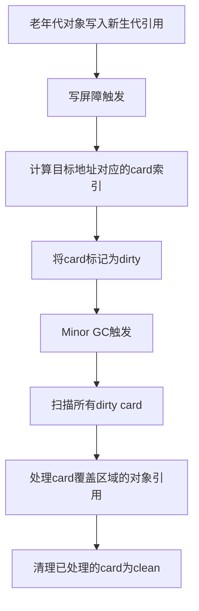

# CardTable机制与使用流程详解

## 1. CardTable 的功能

**CardTable** 是 HotSpot JVM 分代垃圾回收器（如 Serial、Parallel、G1 等）实现“记忆集（Remembered Set）”的核心数据结构。其主要功能是：

- 记录老年代对象对新生代对象的引用，以支持分代GC时的“可达性追踪”。
- 高效标记和查询堆内存的“脏区”，即哪些区域可能包含跨代引用。
- 支持并发/并行GC的增量回收，减少全堆扫描的开销。

---

## 2. CardTable 的使用场景

- **分代GC（如Serial、Parallel、G1）**：在Minor GC时，只需扫描被标记为“脏”的卡片（card），而不是整个老年代。
- **写屏障（Write Barrier）**：每当老年代对象的字段被写入新生代对象引用时，通过写屏障将对应的card标记为“脏”。
- **并发GC**：G1等GC还会用CardTable来追踪分区（region）之间的引用关系。

---

## 3. CardTable 的源码结构与关键方法

位于 `src/hotspot/share/gc/shared/cardTable.hpp`，核心结构如下：

- **成员变量**
  - `_byte_map`：实际的card数组，每个字节代表一段堆内存的状态（干净/脏）。
  - `_byte_map_base`：经过调整的基址，便于地址到card索引的映射。
  - `_whole_heap`：CardTable覆盖的堆区域。
  - `_card_shift`、`_card_size`：每个card覆盖的堆空间大小（如512字节）。

- **核心方法**
  - `byte_for(const void* p)`：将堆地址映射到card数组的索引。
  - `dirty_MemRegion(MemRegion mr)`：将指定内存区域的card标记为脏。
  - `clear_MemRegion(MemRegion mr)`：将指定区域的card清为干净。
  - `is_card_aligned(HeapWord* p)`：判断地址是否为card对齐。
  - `addr_for(const CardValue* p)`：将card索引映射回堆地址。
  - `resize_covered_region(MemRegion new_region)`：动态调整CardTable覆盖的堆区域。

- **Card值**
  - `clean_card`（-1）：表示该区域未被修改。
  - `dirty_card`（0）：表示该区域可能包含跨代引用。

---

## 4. CardTable 的使用流程图



---

## 5. 典型源码调用链

1. **写屏障插入点**（如 G1/Serial/Parallel GC 的 BarrierSet）：
   ```cpp
   CardValue* card = card_table->byte_for(field_address);
   *card = CardTable::dirty_card_val();
   ```

2. **GC时扫描脏卡片**：
   ```cpp
   for (CardValue* card = card_table->byte_map(); card < card_table->byte_map() + card_table->size(); ++card) {
       if (*card == CardTable::dirty_card_val()) {
           HeapWord* region = card_table->addr_for(card);
           // 扫描region内的对象引用
       }
   }
   ```

3. **清理卡片**：
   ```cpp
   card_table->clear_MemRegion(region);
   ```

---

## 6. 总结

- **CardTable** 是分代GC中高效追踪跨代引用的关键结构，极大提升了Minor GC的性能。
- 通过写屏障和card标记机制，GC只需扫描少量“脏区”，避免全堆遍历。
- 其设计兼顾了空间效率（1字节覆盖512字节堆空间）和并发/并行GC的需求。

---

如需进一步分析某一GC（如G1）下CardTable的具体实现或源码细节，请随时告知！