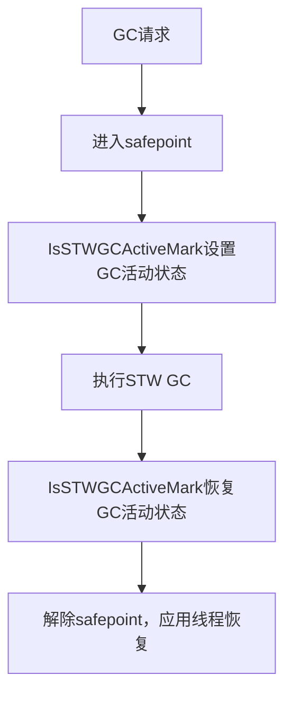

# CollectedHeap GC活动状态管理与子系统协作详解

## 1. GC活动状态管理机制

### 1.1 关键成员与接口
- **_is_stw_gc_active**：标记当前JVM是否处于Stop-The-World（STW）GC活动期间。
- **is_stw_gc_active()**：返回当前GC活动状态，供外部查询。
- **IsSTWGCActiveMark**：RAII方式自动设置和恢复GC活动状态，保证状态切换结构化和安全性。

### 1.2 状态切换流程
- 在STW GC入口处（如Full GC、Young GC），创建`IsSTWGCActiveMark`对象，自动将`_is_stw_gc_active`设为`true`。
- GC结束后，`IsSTWGCActiveMark`析构，自动将`_is_stw_gc_active`恢复为`false`。
- 任何时刻可通过`is_stw_gc_active()`查询当前是否处于GC活动期。

---

## 2. 与Safepoint的协作

### 2.1 Safepoint机制简介
- Safepoint是JVM实现STW GC、类卸载、栈遍历等全局操作的基础机制。
- JVM进入safepoint时，所有Java线程暂停，只有GC等特殊线程继续运行。

### 2.2 GC活动状态与Safepoint的关系
- GC触发时，JVM首先进入safepoint，确保堆一致性。
- 进入safepoint后，GC线程通过`IsSTWGCActiveMark`标记GC活动状态，执行GC。
- safepoint相关代码可通过`is_stw_gc_active()`判断当前是否在GC活动期，调整行为。
- GC结束后，解除safepoint，应用线程恢复。

### 2.3 典型协作流程



---

## 3. 与监控/日志等子系统的协作
- 监控/日志/诊断工具（如JFR、JVM TI、GC日志等）可通过`is_stw_gc_active()`判断当前是否在GC活动期，输出特殊事件或采集数据。
- 例如，GC日志会在GC活动期输出详细的堆变化、暂停时间等信息。
- 监控系统可基于该状态统计GC停顿次数、总时长等指标。

---

## 4. 典型源码协作点

1. **GC入口处标记GC活动期**
   ```cpp
   void SomeGC::do_collection() {
       IsSTWGCActiveMark mark;
       // ... 执行GC ...
   } // 离开作用域时自动恢复GC活动状态
   ```

2. **Safepoint与GC活动状态协作**
   ```cpp
   if (CollectedHeap::is_stw_gc_active()) {
       // 在GC活动期，safepoint相关逻辑可做特殊处理
   }
   ```

3. **监控/日志采集**
   ```cpp
   if (CollectedHeap::is_stw_gc_active()) {
       // 记录GC停顿事件、采集堆快照等
   }
   ```

---

## 5. 总结
- CollectedHeap通过`_is_stw_gc_active`和`IsSTWGCActiveMark`实现了结构化、自动化的GC活动状态管理。
- 该状态与safepoint机制紧密协作，确保GC期间堆一致性和线程安全。
- 监控、日志等子系统可基于该状态实现更精细的事件采集和行为调整。
- 这种设计极大提升了JVM GC相关代码的健壮性、可维护性和可观测性。

---

如需进一步追踪具体GC、safepoint或监控子系统的源码实现细节，请随时告知！