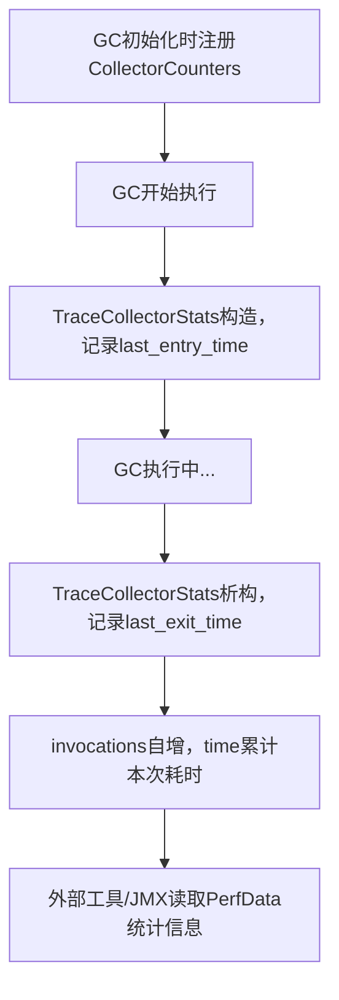

# CollectorCounters机制与使用流程详解

## 1. CollectorCounters 的功能

**CollectorCounters** 是 JVM 性能监控子系统 PerfData 的一部分，专门用于**统计和记录垃圾收集器（GC）相关的性能指标**。其主要功能包括：

- 记录每种垃圾收集器的**调用次数**（invocations）。
- 记录垃圾收集器累计的**总耗时**（time）。
- 记录每次 GC 的**进入时间**和**退出时间**（last_entry_time, last_exit_time）。
- 为 JVM 性能分析、监控工具（如 JConsole、VisualVM、JMC）提供数据支撑。

---

## 2. CollectorCounters 的使用场景

- **GC性能监控**：JVM 启动时自动注册各类 GC 的 CollectorCounters，GC每次执行时自动更新相关计数器。
- **性能分析与调优**：开发者或运维可通过 JMX、PerfData、JVM工具等接口获取GC统计信息，分析GC频率、耗时等，辅助调优。
- **事件追踪**：配合 TraceCollectorStats，可对单次GC事件进行详细的时间追踪。

---

## 3. CollectorCounters 的源码结构与关键方法

位于 `src/hotspot/share/gc/shared/collectorCounters.hpp`，核心结构如下：

- **成员变量**
  - `_invocations`：PerfCounter，记录GC调用次数。
  - `_time`：PerfCounter，记录GC累计耗时。
  - `_last_entry_time`：PerfVariable，记录最近一次GC开始时间。
  - `_last_exit_time`：PerfVariable，记录最近一次GC结束时间。
  - `_name_space`：GC名称空间（如“PS Scavenge”、“G1 Full”）。

- **核心方法**
  - `CollectorCounters(const char* name, int ordinal)`：构造函数，注册并初始化所有计数器。
  - `invocation_counter()`：获取GC调用次数计数器。
  - `time_counter()`：获取GC累计耗时计数器。
  - `last_entry_counter()` / `last_exit_counter()`：获取最近一次GC的进入/退出时间计数器。
  - `name_space()`：获取GC名称空间。

- **TraceCollectorStats**
  - 构造时记录GC开始时间，析构时记录GC结束时间，并自动更新CollectorCounters。

---

## 4. CollectorCounters 的使用流程图



---

## 5. 典型源码调用链

1. **GC初始化时注册计数器**
   ```cpp
   CollectorCounters* counters = new CollectorCounters("PS Scavenge", 0);
   ```

2. **GC执行时自动统计**
   ```cpp
   void ParallelScavengeHeap::do_collection() {
       TraceCollectorStats tcs(counters); // 构造时记录last_entry_time
       // ... GC实际工作 ...
   } // tcs析构时记录last_exit_time，更新invocations和time
   ```

3. **外部工具读取统计信息**
   - 通过JMX、PerfData、JVM工具等接口读取`sun.gc.collector.XXX.invocations`、`time`等指标。

---

## 6. 总结

- **CollectorCounters** 是JVM内置的GC性能统计与监控工具，自动记录GC次数、耗时、最近一次GC的时间点等。
- 其数据可被JVM外部工具实时读取，广泛用于GC性能分析、调优和监控。
- 通过TraceCollectorStats实现自动化的事件追踪和计数器更新，极大简化了GC统计代码。

---

如需进一步分析某一GC下CollectorCounters的具体用法或PerfData的实现细节，请随时告知！