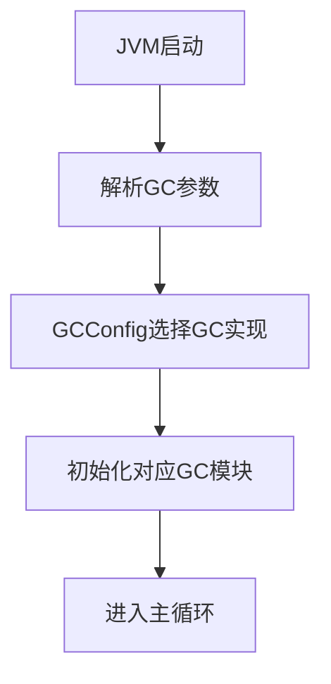
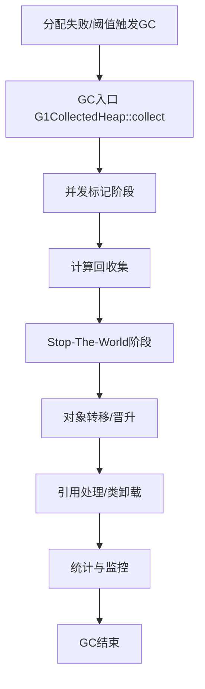
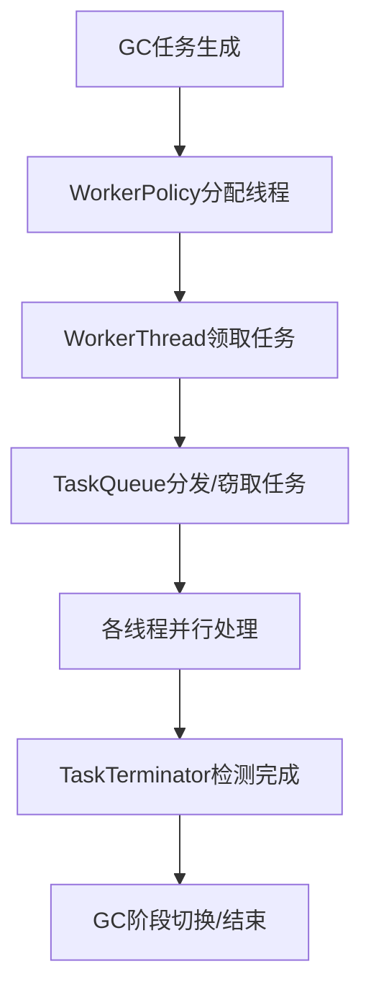
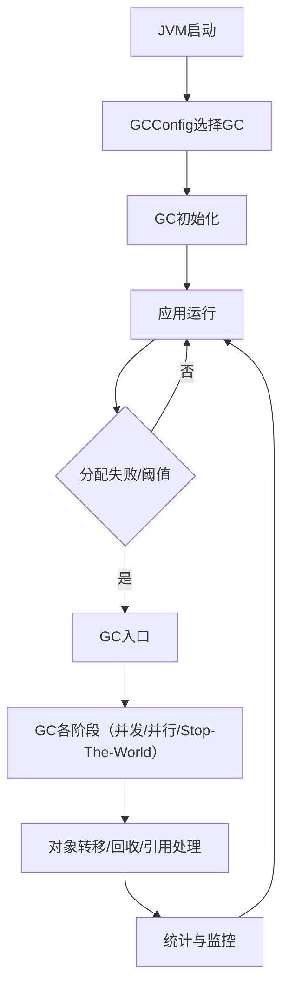

# HotSpot JVM GC 模块全景分析

## 一、目录功能总览

`src/hotspot/share/gc` 是 HotSpot JVM **垃圾收集器（GC）实现的核心目录**，包含了所有 GC 相关的通用基础设施和各类具体 GC 的实现。其结构大致分为：

- **shared/**：GC 通用基础设施（见前文详细分析）
- **g1/**：G1 GC 实现
- **parallel/**：Parallel Scavenge/Parallel Old GC 实现
- **serial/**：Serial GC 实现
- **z/**：ZGC 实现
- **shenandoah/**：Shenandoah GC 实现
- **epsilon/**：Epsilon（空实现）GC
- **cms/**（部分版本）：CMS GC 实现（已废弃）

此外还包含一些全局 GC 配置、参数、统计、辅助工具等。

---

## 二、典型使用场景

- **JVM 启动时选择 GC 策略**（如 G1、Parallel、ZGC、Shenandoah 等）
- **GC Root 遍历与对象扫描**（各GC实现自己的遍历策略）
- **对象分配与晋升**（新生代/老年代/大对象等分配策略）
- **并发/并行 GC**（多线程任务分发、并发标记、并发清理等）
- **弱引用与引用处理**（各GC对软/弱/终结/虚引用的处理）
- **GC 监控与调优**（事件、日志、计数器、JFR集成等）
- **服务线程与后台清理**（如并发清理、类卸载、元数据回收等）

---

## 三、源码结构与关键模块

### 1. shared/（GC通用基础设施）

详见 [HotSpot_GC_Shared_Module_Analysis.md](./HotSpot_GC_Shared_Module_Analysis.md)。

### 2. g1/（G1 GC）

- **G1CollectedHeap**：G1堆主类，管理分区（Region）、分代、对象分配、GC入口等。
- **G1Policy**：G1回收策略与预测模型。
- **G1RemSet**：G1专用的跨区引用集（Remembered Set）。
- **G1ConcurrentMark**：并发标记实现。
- **G1Evacuation**：对象转移与晋升。
- **G1GCPhaseTimes**：各阶段耗时统计。
- **G1ServiceThread**：G1后台服务线程。

### 3. parallel/（Parallel Scavenge/Old）

- **PSYoungGen/PSOldGen**：新生代/老年代实现。
- **ParallelScavengeHeap**：并行堆主类。
- **ParNewGeneration**：并行新生代收集。
- **PSMarkSweep/PSMarkSweepDecorator**：并行标记-清除。
- **PSPromotionManager**：并行晋升管理。
- **PSCardTable**：并行GC卡表。

### 4. serial/（Serial GC）

- **DefNewGeneration/TenuredGeneration**：新生代/老年代实现。
- **SerialHeap**：串行堆主类。
- **MarkSweep**：串行标记-清除。

### 5. z/（ZGC）

- **ZHeap/ZPage**：ZGC堆与分区管理。
- **ZThread/ZTask**：ZGC并发任务与线程。
- **ZBarrierSet**：ZGC专用屏障。
- **ZMark/ZRelocate**：并发标记与对象转移。
- **ZServiceThread**：ZGC服务线程。

### 6. shenandoah/（Shenandoah GC）

- **ShenandoahHeap**：Shenandoah堆主类。
- **ShenandoahConcurrentMark**：并发标记。
- **ShenandoahEvacuation**：对象转移。
- **ShenandoahBarrierSet**：Shenandoah专用屏障。
- **ShenandoahControlThread**：控制与服务线程。

### 7. epsilon/（Epsilon GC）

- **EpsilonHeap**：空实现堆，仅分配不回收，便于性能测试。

### 8. 全局配置与辅助

- **gc_globals.hpp**：GC相关JVM参数定义。
- **gcConfig.hpp/cpp**：GC选择与配置逻辑。
- **gcCause.hpp/cpp**：GC触发原因枚举与描述。
- **gcTrace.hpp/cpp**：GC事件追踪与JFR集成。
- **workerPolicy.hpp/cpp**：并行GC线程池策略。

---

## 四、典型使用流程

### 1. JVM 启动与GC选择



### 2. G1 GC 典型回收流程



### 3. 并发/并行GC任务调度（通用）



---

## 五、源码片段举例

### 1. GC选择与初始化

```cpp
// gcConfig.cpp
void GCConfig::initialize() {
    // 根据参数选择GC
    if (UseG1GC) { ... }
    else if (UseParallelGC) { ... }
    // ...
}
```

### 2. G1 GC入口

```cpp
// g1CollectedHeap.cpp
void G1CollectedHeap::collect(GCCause::Cause cause) {
    // 1. 并发标记
    // 2. 计算回收集
    // 3. STW对象转移
    // 4. 弱引用处理
    // 5. 统计与监控
}
```

### 3. 并行任务分发

```cpp
// workerPolicy.cpp
void WorkerPolicy::run_task(WorkerTask* task) {
    // 多线程并行执行GC任务
}
```

---

## 六、设计优势与总结

- **高度模块化**：各GC实现独立，通用基础设施复用，便于维护和扩展。
- **多GC策略支持**：支持G1、Parallel、Serial、ZGC、Shenandoah等多种GC，满足不同场景需求。
- **并发/并行友好**：大量并发安全设计，支持高性能GC。
- **统一接口**：如BarrierSet、ReferenceProcessor等，便于不同GC实现复用。
- **监控与调优**：丰富的计数器、事件、日志，便于性能分析和调优。
- **灵活扩展**：支持新GC、新引用类型、新分配策略的快速集成。

---

## 七、参考流程图（全局视角）



---

如需**某个具体GC（如G1、ZGC、Shenandoah等）或某个基础设施模块的详细源码流程和类图**，请指定模块名，可进一步深入分析。