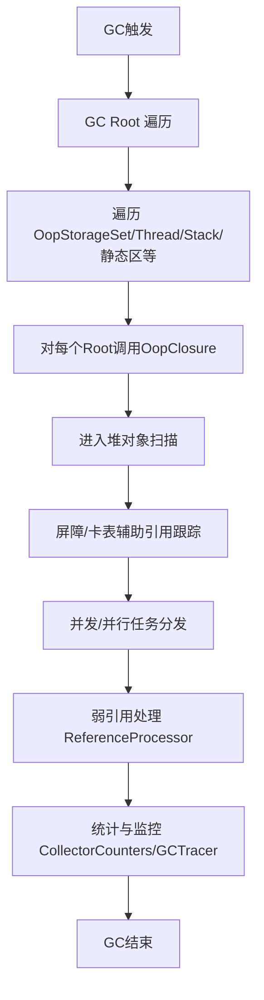
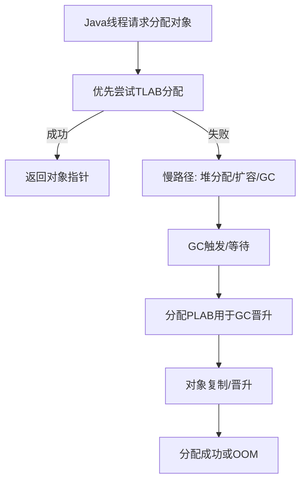
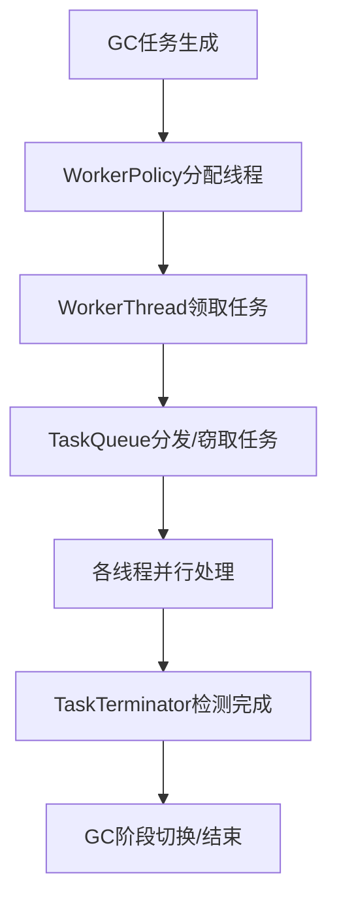

# HotSpot JVM GC Shared 基础设施模块详解

## 一、目录功能总览

`src/hotspot/share/gc/shared` 目录是 HotSpot JVM 各种垃圾收集器（GC）**共享的基础设施实现**，包括：
- 内存分配与管理
- 对象分配与分配缓冲
- 屏障与卡表
- 统计与监控
- 并发与并行支持
- 弱引用与引用处理
- 线程本地分配缓冲（TLAB）
- Root 管理、遍历与辅助工具

这些模块为 Serial、Parallel、G1、ZGC、Shenandoah 等不同 GC 提供统一的底层支撑。

---

## 二、典型使用场景

- **GC Root 遍历与对象扫描**：GC 统一遍历所有根和堆对象。
- **对象分配与缓冲**：支持高效的对象分配（TLAB/PLAB）、并发分配、OOM处理。
- **屏障与卡表**：支持写屏障、读屏障、跨代引用跟踪。
- **并发/并行 GC**：多线程任务分发、同步、并发遍历。
- **弱引用与引用处理**：统一管理和处理 Soft/Weak/Final/PhantomReference。
- **监控与调优**：GC事件、统计、性能计数器、日志等。
- **服务线程与后台清理**：如 OopStorage 清理、卡表维护等。

---

## 三、源码结构与关键模块

### 1. 内存与对象分配

- **CollectedHeap/CollectedHeap.hpp/cpp**
  JVM堆的抽象基类，定义了堆的分配、回收、GC入口、TLAB管理等通用接口。
- **MemAllocator/memAllocator.hpp/cpp**
  对象分配器，支持普通对象、数组、类元数据的分配，封装了分配流程、事件通知、OOM处理等。
- **PLAB/plab.hpp/cpp**
  并行GC晋升缓冲区（Promotion/Parallel Local Allocation Buffer），用于GC对象复制时的线程本地分配。
- **ThreadLocalAllocBuffer/threadLocalAllocBuffer.hpp/cpp**
  线程本地分配缓冲区（TLAB），提升对象分配效率，减少锁竞争。

### 2. 屏障与卡表

- **BarrierSet/barrierSet.hpp/cpp**
  屏障集抽象，定义了GC屏障的统一接口（如写屏障、读屏障、clone屏障等）。
- **CardTable/cardTable.hpp/cpp**
  卡表实现，支持分代GC的跨代引用跟踪。
- **CardTableBarrierSet/cardTableBarrierSet.hpp/cpp**
  基于卡表的屏障集实现，集成卡表与屏障逻辑。

### 3. 统计与监控

- **CollectorCounters/collectorCounters.hpp/cpp**
  GC收集器性能计数器。
- **GenerationCounters/generationCounters.hpp/cpp**
  堆分代统计计数器。
- **GCPolicyCounters/gcPolicyCounters.hpp/cpp**
  GC策略相关计数器。
- **GCTracer/gcTrace.hpp/cpp**
  GC事件追踪与JFR集成。
- **GCLogPrecious/gcLogPrecious.hpp/cpp**
  GC关键日志输出。

### 4. 并发与并行支持

- **WorkerPolicy/workerPolicy.hpp/cpp**
  并行GC线程池与任务分发策略。
- **WorkerThread/workerThread.hpp/cpp**
  并行GC工作线程实现。
- **TaskQueue/taskqueue.hpp/cpp**
  并行任务队列，支持工作窃取。
- **TaskTerminator/taskTerminator.hpp/cpp**
  并行任务终结器，协调多线程任务完成。

### 5. 弱引用与引用处理

- **ReferenceProcessor/referenceProcessor.hpp/cpp**
  统一的弱引用发现与处理框架，支持软/弱/终结/虚引用。
- **ReferencePolicy/referencePolicy.hpp/cpp**
  弱引用清理策略（如LRU、NeverClear等）。
- **ReferenceDiscoverer/referenceDiscoverer.hpp**
  弱引用发现接口。

### 6. Root 管理与辅助工具

- **OopStorage/oopStorage.hpp/cpp**
  管理JVM内部所有oop引用的存储结构，支持并发遍历、批量分配/释放。
- **OopStorageSet/oopStorageSet.hpp/cpp**
  统一管理所有OopStorage实例，支持批量遍历与并发遍历。
- **OopStorageSetParState/oopStorageSetParState.hpp/inline.hpp**
  支持多线程并发遍历所有OopStorage。
- **StrongRootsScope/strongRootsScope.hpp/cpp**
  GC Root遍历作用域管理。
- **PartialArraySplitter/partialArraySplitter.hpp/cpp**
  支持大数组并行分割遍历。

---

## 四、典型使用流程

### 1. GC Root 遍历与对象扫描



### 2. 对象分配与TLAB/PLAB



### 3. 并发/并行GC任务调度



---

## 五、源码片段举例

### 1. 对象分配（TLAB/PLAB）

```cpp
oop CollectedHeap::obj_allocate(Klass* klass, size_t size, TRAPS) {
    ObjAllocator allocator(klass, size, THREAD);
    return allocator.allocate();
}
```

### 2. OopStorageSet 并发遍历

```cpp
OopStorageSetWeakParState<true, false> par_state;
for (auto id : EnumRange<OopStorageSet::WeakId>()) {
    par_state.par_state(id)->oops_do(closure);
}
par_state.report_num_dead();
```

### 3. GC Root 遍历

```cpp
void CollectedHeap::object_iterate(ObjectClosure* cl) {
    // 遍历所有OopStorage、线程栈、JNI等root
    OopStorageSet::strong_oops_do(cl);
    // ... 其他root
}
```

---

## 六、设计优势与总结

- **高度模块化**：各GC共享基础设施，便于维护和扩展。
- **并发/并行友好**：大量并发安全设计，支持高性能GC。
- **统一接口**：如BarrierSet、ReferenceProcessor等，便于不同GC实现复用。
- **监控与调优**：丰富的计数器、事件、日志，便于性能分析和调优。
- **灵活扩展**：支持新GC、新引用类型、新分配策略的快速集成。

---

如需**某个具体子模块的详细源码流程和类图**，请指定模块名（如 ReferenceProcessor、PLAB、BarrierSet、OopStorage 等），可进一步深入分析。