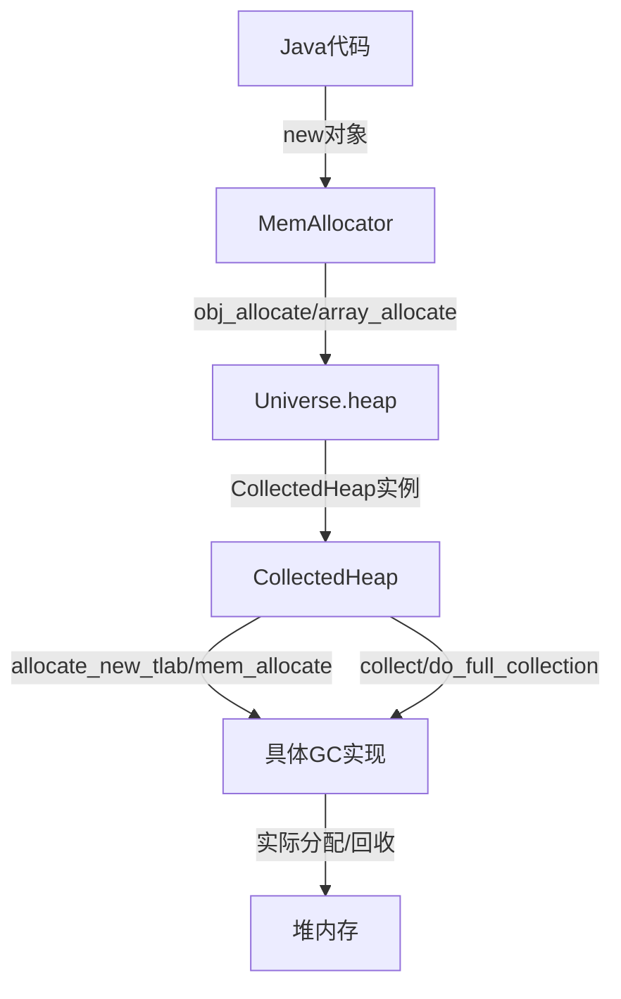

# JVM与CollectedHeap内存分配与回收机制

## 1. CollectedHeap的作用

`CollectedHeap` 是HotSpot所有GC实现的抽象基类，定义了**内存分配**和**垃圾回收**的统一接口。JVM的所有对象分配和GC操作，最终都会通过CollectedHeap的派生类（如G1CollectedHeap、ParallelScavengeHeap等）来完成。

---

## 2. 内存分配流程

### 2.1 Java对象分配的入口
- Java层的 `new` 操作，最终会调用到JVM的 `MemAllocator`。
- `MemAllocator` 会调用 `CollectedHeap::obj_allocate` 或 `CollectedHeap::array_allocate`。

**源码示例：**
```cpp
oop MemAllocator::obj_allocate(Klass* klass, size_t size, TRAPS) {
    // ... 省略检查 ...
    HeapWord* mem = Universe::heap()->obj_allocate(klass, size, CHECK_NULL);
    // ... 构造对象头等 ...
}
```
- `Universe::heap()` 返回的就是当前激活的 CollectedHeap 实例。

### 2.2 TLAB分配优先
- 如果开启了TLAB，线程会优先在自己的TLAB中分配对象。
- 如果TLAB空间不足，则调用 `CollectedHeap::allocate_new_tlab` 申请新的TLAB。

### 2.3 堆分配（慢路径）
- 如果TLAB不可用或对象过大，JVM会直接调用 `CollectedHeap::mem_allocate` 在堆上分配。
- 该方法由具体GC实现（如G1CollectedHeap、ParallelScavengeHeap等）重载，负责实际的堆空间分配。

**伪代码流程：**
```
Java线程分配对象
 └─> TLAB分配（快路径）
      └─> 不足时，CollectedHeap::allocate_new_tlab
           └─> 堆分配（慢路径）CollectedHeap::mem_allocate
```

---

## 3. 垃圾回收流程

### 3.1 触发GC的入口
- JVM在以下场景会触发GC：
  - 堆空间不足（分配失败）
  - 显式调用 `System.gc()`
  - JIT/内部策略等
- 触发GC时，JVM会调用 `CollectedHeap::collect(GCCause::Cause cause)`。

**源码示例：**
```cpp
void CollectedHeap::collect(GCCause::Cause cause) {
    // 由具体GC实现重载
}
```

### 3.2 GC实现的多态分发
- `collect` 是纯虚函数，由各GC实现（如G1CollectedHeap、ParallelScavengeHeap等）实现具体的回收逻辑。
- 例如，G1CollectedHeap会根据当前堆状态选择Young GC、Mixed GC或Full GC。

### 3.3 Full GC
- JVM还会在需要时调用 `CollectedHeap::do_full_collection` 进行完整的堆回收。

---

## 4. 关键接口方法

- **分配相关：**
  - `HeapWord* allocate_new_tlab(size_t min_size, size_t requested_size, size_t* actual_size)`
  - `HeapWord* mem_allocate(size_t size, bool* gc_overhead_limit_was_exceeded)`
  - `oop obj_allocate(Klass* klass, size_t size, TRAPS)`
  - `oop array_allocate(Klass* klass, size_t size, int length, bool do_zero, TRAPS)`

- **回收相关：**
  - `void collect(GCCause::Cause cause)`
  - `void do_full_collection(bool clear_all_soft_refs)`

---

## 5. JVM与CollectedHeap的关系图



---

## 6. 总结

- **JVM所有对象分配和GC操作，最终都通过CollectedHeap的多态接口完成。**
- **CollectedHeap屏蔽了不同GC实现的细节，提供了统一的分配和回收入口。**
- **具体GC实现负责实际的内存管理策略和算法。**

如需查看具体实现，可参考 `src/hotspot/share/gc/shared/collectedHeap.hpp` 及各GC子类的实现文件。