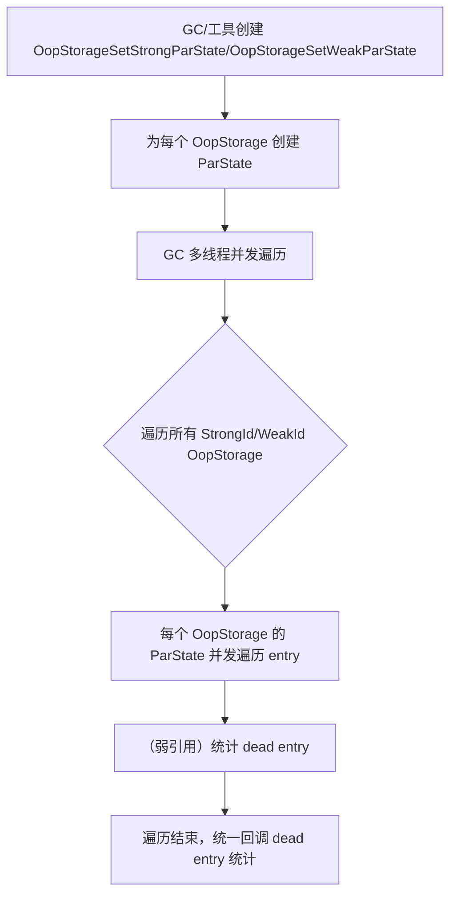

# OopStorageSet 及 OopStorageSetParState 机制详解

## 一、功能概述

### OopStorageSet

- **OopStorageSet** 是 HotSpot JVM 内部用于统一管理所有 OopStorage 实例（如 StringTable、JNI 全局/弱全局引用表等）的静态工具类。
- 提供了对所有“强引用”与“弱引用” OopStorage 的统一枚举、批量操作、并发遍历等能力。
- 支持通过类型安全的枚举（StrongId、WeakId、Id）访问和遍历各类 OopStorage。

### OopStorageSetParState

- **OopStorageSetParState** 及其子类（OopStorageSetStrongParState、OopStorageSetWeakParState）为批量并发/并行遍历所有 OopStorage 提供统一的状态管理和调度。
- 支持 GC 多线程并发遍历所有强/弱 OopStorage，自动统计 dead entry，支持回调。

---

## 二、典型使用场景

- **GC Root 扫描与并发标记**：GC 需要并发/并行遍历所有 root OopStorage（如 StringTable、JNI 全局/弱全局引用等），统一调度和统计 dead entry。
- **批量 OopClosure 操作**：如 JVM 内部工具、监控、诊断等场景下，对所有 OopStorage 进行批量 OopClosure 操作。
- **统一管理与扩展**：便于后续扩展新的 OopStorage 类型，统一管理和批量操作。

---

## 三、源码结构与关键实现

### 1. 主要类与结构

- **OopStorageSet**
  - 静态管理所有 OopStorage 实例，提供类型安全的枚举与批量操作接口。
  - 主要枚举类型：StrongId、WeakId、Id。
  - 提供 storage(id)、strong_oops_do(cl) 等批量操作。
- **OopStorageSetParState（模板基类）**
  - 模板参数：StorageId（StrongId/WeakId）、concurrent、is_const。
  - 内部持有所有 OopStorage::ParState 实例的数组，支持并发遍历。
- **OopStorageSetStrongParState / OopStorageSetWeakParState**
  - 分别用于所有强引用/弱引用 OopStorage 的并发遍历与 dead entry 统计。
- **DeadCounterClosure**
  - 辅助 closure，用于遍历时统计 dead entry 数量。

### 2. 关键成员与方法

- `OopStorageSet::storage(StrongId/WeakId/Id id)`：按类型安全枚举获取 OopStorage。
- `OopStorageSet::strong_oops_do(cl)`：对所有强引用 OopStorage 执行 cl->do_oop。
- `OopStorageSetParState::par_state(id)`：获取指定 OopStorage 的 ParState。
- `OopStorageSetStrongParState::oops_do(cl)`：并发遍历所有强引用 OopStorage。
- `OopStorageSetWeakParState::oops_do(cl)`：并发遍历所有弱引用 OopStorage，自动统计 dead entry。
- `OopStorageSetWeakParState::report_num_dead()`：遍历后统一回调 dead entry 统计。

### 3. 并发与批量遍历设计

- **类型安全枚举**：通过 StrongId/WeakId/Id 枚举，保证类型安全和可扩展性。
- **批量并发遍历**：每个 OopStorage 拥有独立 ParState，GC 多线程可并发遍历所有 OopStorage。
- **dead entry 统计**：弱引用遍历时自动统计 dead entry，遍历后统一回调。
- **批量 OopClosure 适配**：支持任意 OopClosure/函数对象批量操作。

---

## 四、典型使用流程图

### 1. 批量并发遍历所有 OopStorage



### 2. OopStorageSet::strong_oops_do 批量操作流程

```mermaid
flowchart TD
    A[调用 strong_oops_do(cl)] --> B[遍历所有 StrongId]
    B --> C[对每个 OopStorage 执行 oops_do(cl)]
```

### 3. OopStorageSetWeakParState::oops_do 统计 dead entry 流程

```mermaid
flowchart TD
    A[遍历 WeakId OopStorage] --> B[ParState::oops_do(DeadCounterClosure)]
    B --> C[DeadCounterClosure 统计 dead entry]
    C --> D[ParState::increment_num_dead]
    D --> E[遍历结束后 report_num_dead 统一回调]
```

---

## 五、源码实现要点

### 1. 类型安全与可扩展性

- 通过 StrongId/WeakId/Id 枚举和 EnumRange，保证类型安全和后续扩展新 OopStorage 的便利性。

### 2. 并发批量遍历

- 每个 OopStorage 独立 ParState，GC 多线程可并发遍历所有 OopStorage，极大提升 root 扫描效率。

### 3. dead entry 统计与回调

- 弱引用遍历时自动统计 dead entry，遍历后统一回调，便于 GC 清理和监控。

### 4. 统一批量操作接口

- strong_oops_do、par_state、oops_do 等接口，便于批量操作和统一管理。

---

## 六、设计优势与总结

- **统一管理**：所有 OopStorage 统一注册、批量操作、便于扩展。
- **高效并发**：多线程并发遍历所有 OopStorage，极大提升 GC 性能。
- **类型安全**：枚举与模板机制保证类型安全和可维护性。
- **自动统计**：弱引用遍历自动 dead entry 统计与回调，便于 GC 管理。
- **灵活适配**：支持任意 OopClosure/函数对象批量操作，适应多种场景。

---

## 七、参考源码位置

- `src/hotspot/share/gc/shared/oopStorageSet.hpp`
- `src/hotspot/share/gc/shared/oopStorageSet.inline.hpp`
- `src/hotspot/share/gc/shared/oopStorageSetParState.hpp`
- `src/hotspot/share/gc/shared/oopStorageSetParState.inline.hpp`

---

如需更详细的源码注释、流程细节或特定 GC 场景的深入分析，可进一步指定需求。