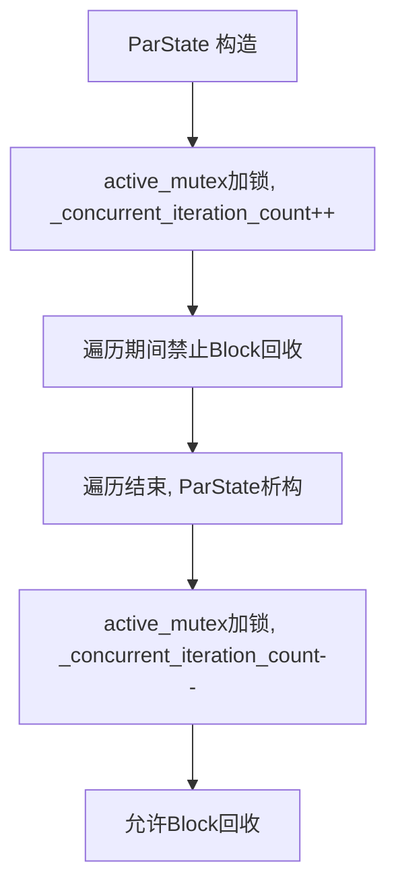

# HotSpot JVM OopStorage 并发/并行遍历机制（ParState）详解

## 一、功能概述

**OopStorage::ParState** 及其相关基础设施，专为支持 HotSpot JVM GC 期间对 OopStorage 中所有 entry 的高效并发/并行遍历而设计。其核心目标是：

- 支持多线程（并行）甚至与 mutator 并发地遍历 OopStorage 持有的所有对象引用。
- 保证遍历期间 Block 不被回收，遍历序列稳定，但允许 entry 内容随时变化（如被分配/释放）。
- 提供灵活的遍历适配接口，支持强/弱引用处理、is_alive 过滤、回调统计等。

---

## 二、典型使用场景

- **GC 并发标记/清理阶段**：如 G1、ZGC、Shenandoah 等并发 GC，需要多线程遍历 StringTable、JNI 全局引用等 OopStorage 持有的所有对象引用，进行可达性标记或清理。
- **串行/并行 GC 的多线程 root 扫描**：ParallelGC、SerialGC 也可利用 ParState 进行多线程 root 扫描。
- **JVM 内部工具/监控**：如 JFR、JVMTI agent 需要并发遍历所有持有的对象引用。
- **支持弱引用、is_alive 过滤、统计 dead entry 等扩展场景**。

---

## 三、源码结构与关键实现

### 1. 主要类与结构

- **OopStorage::ParState<concurrent, is_const>**
  - 并发/并行遍历的状态与分段调度器，模板参数控制并发性与可变性。
- **OopStorage::BasicParState**
  - ParState 的实现基类，管理遍历快照、分段调度、并发计数等。
- **OopStorage::ActiveArray**
  - Block 指针数组，遍历期间快照，保证遍历序列稳定。
- **辅助适配器**：如 AlwaysTrueFn、oop_fn、skip_null_fn、if_alive_fn 等，适配 closure、is_alive 过滤等。

### 2. 关键成员与方法

- `ParState(StoragePtr storage, uint estimated_thread_count)`
  - 构造遍历状态，捕获 ActiveArray 快照，设置并发计数。
- `template<typename F> void iterate(F f)`
  - 多线程分段遍历所有 Block，并对每个 entry 执行 f。
- `template<typename Closure> void oops_do(Closure* cl)`
  - 适配 OopClosure，遍历所有 entry 并回调 cl->do_oop。
- `template<typename Closure> void weak_oops_do(Closure* cl)`
  - 仅在非并发/可变遍历下提供，自动跳过 null entry。
- `template<typename IsAliveClosure, typename Closure> void weak_oops_do(IsAliveClosure* is_alive, Closure* cl)`
  - 仅在非并发/可变遍历下提供，is_alive 过滤并清理 dead entry。
- `size_t num_dead() const` / `void increment_num_dead(size_t)` / `void report_num_dead() const`
  - 支持 dead entry 统计与回调。

### 3. 并发与一致性设计

- **遍历快照**：遍历开始时捕获 ActiveArray 快照，遍历期间 Block 集合不变，entry 内容可变。
- **分段调度**：多线程通过原子自增 `_next_block`，分段 claim Block，避免竞争。
- **并发安全**：遍历期间禁止 Block 回收（_concurrent_iteration_count > 0），但允许分配新 Block（新 Block 不被本次遍历看到）。
- **entry 可变性**：遍历期间 entry 可能被分配/释放，遍历 handler 需容忍 entry 内容变化。
- **弱引用/过滤**：非并发/可变遍历下可安全进行 is_alive 过滤与 dead entry 清理。

---

## 四、典型使用流程图

### 1. 多线程并发遍历流程

```mermaid
flowchart TD
    A[GC/工具创建 ParState] --> B[捕获 ActiveArray 快照]
    B --> C[多线程并发调用 iterate()]
    C --> D{claim_next_segment}
    D -- 有剩余Block --> E[遍历分配到的Block区间]
    E --> F[对每个已分配entry执行handler]
    F --> D
    D -- 无剩余Block --> G[遍历结束，统计/回调]
```

### 2. 并发遍历与 Block 生命周期协作



### 3. 弱引用遍历与 is_alive 过滤（仅非并发/可变）

```mermaid
flowchart TD
    A[遍历entry] --> B{*p == nullptr?}
    B -- 是 --> C[跳过]
    B -- 否 --> D{is_alive->do_object_b(*p)?}
    D -- 否 --> E[*p = nullptr, 统计dead]
    D -- 是 --> F[closure->do_oop(p)]
```

---

## 五、源码实现要点

### 1. ParState 构造与遍历快照

- 构造时捕获 OopStorage 的 ActiveArray 快照，记录 block_count。
- 并发遍历时，active_mutex 加锁，_concurrent_iteration_count++，禁止 Block 回收。

### 2. 分段遍历与多线程调度

- 多线程通过原子自增 `_next_block`，每次 claim 一段 Block 区间，避免竞争。
- 每个线程独立遍历分配到的 Block 区间，遍历 Block 内所有已分配 entry。

### 3. Handler 适配与扩展

- 支持任意函数对象、OopClosure、is_alive 过滤、skip_null、dead entry 统计等多种 handler。
- 非并发/可变遍历下，支持弱引用清理与 is_alive 过滤。

### 4. 并发与一致性保障

- 遍历期间 Block 集合不变，entry 内容可变，handler 需容忍 entry 变化。
- 并发遍历与 Block 回收通过 _concurrent_iteration_count 协作，防止遍历期间 Block 被回收。

---

## 六、设计优势与总结

- **高效并发**：多线程分段遍历，极大提升 GC root 扫描与标记效率。
- **一致性保障**：遍历快照机制保证遍历序列稳定，避免并发回收风险。
- **灵活适配**：支持强/弱引用、is_alive 过滤、统计回调等多种遍历需求。
- **GC 友好**：与 Block 生命周期、回收机制紧密协作，保证安全。
- **通用性强**：适用于 GC、JNI、JVM 工具等多种并发遍历场景。

---

## 七、参考源码位置

- `src/hotspot/share/gc/shared/oopStorageParState.hpp`
- `src/hotspot/share/gc/shared/oopStorageParState.inline.hpp`
- `src/hotspot/share/gc/shared/oopStorage.hpp`
- `src/hotspot/share/gc/shared/oopStorage.cpp`

---

如需更详细的源码注释、流程细节或特定 GC 场景的深入分析，可进一步指定需求。