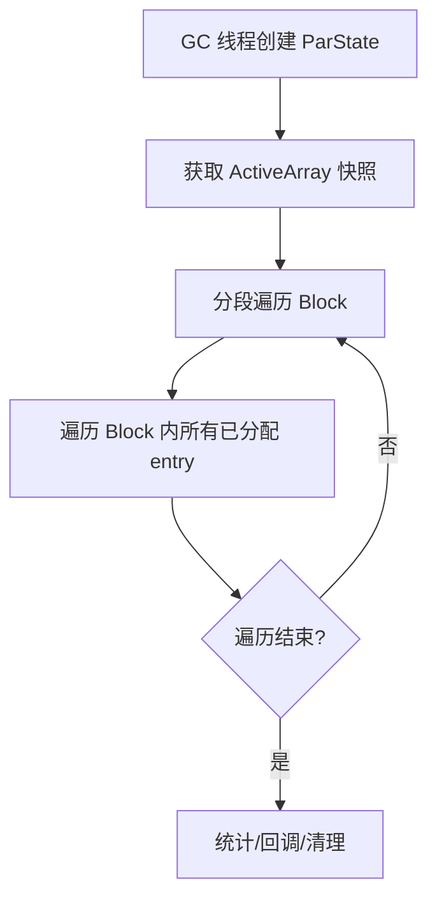

# HotSpot JVM OopStorage 机制详解

## 一、功能概述

**OopStorage** 是 HotSpot JVM 为管理“堆外对象引用”而设计的通用存储结构。它为 GC、JNI、JVM 内部等需要“持有 Java 堆对象引用但不直接存放于 Java 堆内存”的场景，提供了高效、线程安全、支持并发迭代的引用分配、释放与遍历能力。

- **主要功能**：
  - 管理一组 off-heap 的 oop*（对象引用指针）entry。
  - 支持分配/释放 entry，entry 指向 Java 堆对象。
  - 支持 GC 并发/串行遍历所有 entry。
  - 支持空闲块回收、内存扩展、并发安全。
  - 支持弱引用、回调、统计等扩展。

---

## 二、典型使用场景

- **JNI 全局/弱全局引用表**：JNI 全局引用需要跨 GC 生命周期持有对象引用，OopStorage 提供底层支持。
- **JVM 内部弱引用表**：如 StringTable、SystemDictionary、JVM TI agent 持有的对象引用等。
- **GC 相关的特殊引用管理**：如 JFR、JVMTI、ReferenceProcessor 等。
- **需要高效并发分配/释放/遍历对象引用的场景**。

---

## 三、源码结构与关键实现

### 1. 主要类与结构

- **OopStorage**：核心类，管理所有 entry 的分配、释放、遍历、内存管理等。
- **OopStorage::Block**：固定大小的 oop* 数组及其分配位图，是 entry 的实际存储单元。
- **OopStorage::ActiveArray**：Block 指针数组，管理所有活跃 Block。
- **OopStorage::AllocationList**：双向链表，管理可分配 Block。
- **OopStorage::ParState**：并发遍历支持。
- **OopStorage::NumDeadCallback**：GC 清理时的回调机制。

### 2. 关键成员与方法

- `oop* allocate()` / `size_t allocate(oop**, size_t)`：分配单个/批量 entry。
- `void release(const oop* ptr)` / `void release(const oop* const* ptrs, size_t size)`：释放 entry。
- `template<typename F> bool iterate_safepoint(F f)`：在 safepoint 下遍历所有 entry。
- `template<bool concurrent, bool is_const> class ParState`：并发遍历支持。
- `bool delete_empty_blocks()`：回收空闲 Block。
- `size_t allocation_count()` / `size_t block_count()`：统计信息。

### 3. 内存与并发管理

- **Block 分配与回收**：Block 满时从分配链表移除，空时可回收。
- **分配位图**：每个 Block 用 bitmask 标记哪些 entry 已分配。
- **并发安全**：分配/释放/遍历均有细致的锁与原子操作设计，支持并发 GC。
- **延迟更新机制**：释放 entry 时如需修改分配链表，采用 deferred_updates 列表延迟处理，避免锁竞争。

---

## 四、典型使用流程图

### 1. Entry 分配流程

```mermaid
flowchart TD
    A[调用 OopStorage::allocate()] --> B{分配链表有可用 Block?}
    B -- 有 --> C[从 Block 分配 entry，更新位图]
    C --> D{Block 是否已满?}
    D -- 是 --> E[从分配链表移除 Block]
    D -- 否 --> F[Block 保持在链表]
    B -- 无 --> G[尝试分配新 Block]
    G -- 成功 --> H[加入分配链表，重试分配]
    G -- 失败 --> I[分配失败，返回 nullptr]
```

### 2. Entry 释放流程

```mermaid
flowchart TD
    A[调用 OopStorage::release(ptr)] --> B[定位 Block]
    B --> C[原子更新分配位图]
    C --> D{Block 状态变化?}
    D -- 变空/变非满 --> E[加入 deferred_updates 列表]
    D -- 否 --> F[无需链表操作]
    E --> G[后续由分配/清理线程处理链表]
```

### 3. GC 并发遍历流程



---

## 五、源码实现要点（以 allocate/release 为例）

### 1. 分配（allocate）

- 加锁 `_allocation_mutex`，优先从分配链表头部 Block 分配 entry。
- Block 满则移出分配链表；Block 空则尝试分配新 Block 并加入链表。
- 支持批量分配，优先分配整块，剩余多余 entry 立即释放。

### 2. 释放（release）

- 通过指针定位 Block，原子更新分配位图。
- 若 Block 状态发生变化（如变空/变非满），则将 Block 加入 deferred_updates 列表，延迟链表操作，避免锁竞争。
- deferred_updates 由分配或清理线程在安全点统一处理。

### 3. 并发遍历

- GC 并发遍历时，ParState 获取 ActiveArray 快照，分段遍历 Block，保证遍历期间 Block 不被回收。
- 支持统计 dead entry 并回调。

---

## 六、总结与设计优势

- **高效分配/释放**：批量分配、位图管理、链表优化，分配/释放性能高。
- **并发安全**：细粒度锁、原子操作、延迟更新，支持高并发场景。
- **GC 友好**：支持并发遍历、弱引用、回调，便于 GC 管理。
- **内存弹性**：Block 动态扩展与回收，内存利用率高。
- **通用性强**：适用于多种 JVM 内部和 JNI 场景。

---

## 七、参考源码位置

- `src/hotspot/share/gc/shared/oopStorage.hpp`
- `src/hotspot/share/gc/shared/oopStorage.cpp`
- `src/hotspot/share/gc/shared/oopStorage.inline.hpp`

---

如需更详细的源码注释、流程细节或特定场景的深入分析，可进一步指定需求。