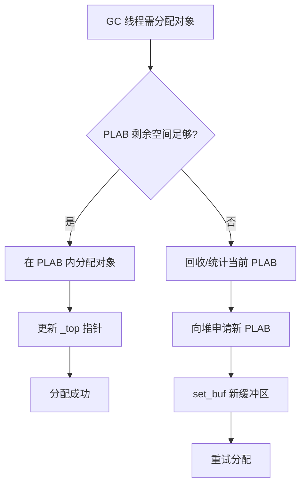
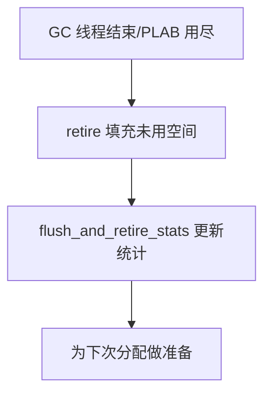
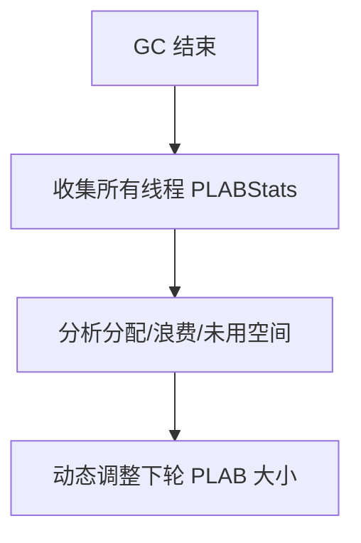

# PLAB（并行/提升局部分配缓冲区）机制详解

## 一、功能概述

**PLAB**（Parallel/Promotion Local Allocation Buffer）是 HotSpot JVM GC 实现中的一种**每线程局部分配缓冲区**，用于在并行 GC（如 ParallelGC、G1、Shenandoah、ZGC）对象复制、晋升等过程中，减少线程间竞争、提升分配效率。

- **核心目标**：
  - 为 GC 线程提供独立的分配缓冲区，避免频繁争抢全局堆锁。
  - 支持对象批量复制/晋升时的高效分配，提升 GC 吞吐。
  - 动态调整缓冲区大小，兼顾内存利用率与分配性能。

---

## 二、典型使用场景

- **并行/并发 GC 对象复制**：如 G1、ParallelGC、Shenandoah、ZGC 等在 Minor GC、Full GC、并发标记等阶段，GC 线程需将存活对象批量复制到新生代/老年代/Survivor 区。
- **对象晋升（Promotion）**：对象晋升到老年代时，GC 线程通过 PLAB 批量分配，减少堆锁竞争。
- **GC 线程本地分配**：每个 GC 线程拥有独立 PLAB，分配对象时无需全局同步。

---

## 三、源码结构与关键实现

### 1. 主要类与结构

- **PLAB**
  - 每个 GC 线程持有的分配缓冲区，负责对象批量分配、回收、统计。
  - 关键成员：_bottom/_top/_end/_hard_end（缓冲区指针）、_word_sz（缓冲区大小）、_allocated/_wasted/_undo_wasted（统计）。
- **PLABStats**
  - 记录 PLAB 分配、浪费、未用空间等统计信息，支持动态调整 PLAB 大小。

### 2. 关键成员与方法

#### PLAB

- `PLAB(size_t word_sz)`：构造函数，初始化缓冲区大小。
- `void set_buf(HeapWord* buf, size_t new_word_sz)`：设置缓冲区起始地址和大小。
- `HeapWord* allocate(size_t word_sz)`：在缓冲区内分配对象，若空间不足返回 nullptr。
- `void retire()`：回收未用空间，填充 dummy 对象，统计浪费。
- `void flush_and_retire_stats(PLABStats* stats)`：回收缓冲区并更新统计。
- `void undo_allocation(HeapWord* obj, size_t word_sz)`：撤销上一次分配。
- `size_t words_remaining()`：剩余可分配空间。
- `bool contains(void* addr)`：判断地址是否在本缓冲区内。

#### PLABStats

- `add_allocated/add_wasted/add_unused/add_undo_wasted`：统计分配、浪费、未用空间。
- `size_t used()/wasted()/unused()/allocated()`：获取各类统计数据。
- `min_size()/max_size()`：PLAB 尺寸边界。

---

## 四、典型使用流程图

### 1. GC 线程对象复制/晋升分配流程

### 2. PLAB 回收与统计流程

### 3. PLAB 动态调整流程（与 PLABStats 协作）

---

## 五、源码实现要点

### 1. 高效分配与线程隔离

- 每个 GC 线程独立持有 PLAB，分配对象时只需移动 _top 指针，无需全局同步。
- PLAB 空间用尽时，才向全局堆申请新缓冲区，极大减少锁竞争。

### 2. 内存利用与浪费控制

- PLAB 可能存在未用空间（如最后一块未填满），通过 retire/flush_and_retire_stats 统计浪费。
- PLABStats 汇总所有线程的分配/浪费数据，动态调整 PLAB 大小，兼顾分配效率与内存利用率。

### 3. 支持撤销与回收

- 支持 undo_allocation/undo_last_allocation，便于 GC 过程中回滚分配。
- retire 填充未用空间为 dummy 对象，保证堆结构一致性。

### 4. 动态调整与自适应

- GC 结束后，根据统计数据自适应调整 PLAB 大小，适应不同 GC 负载。

---

## 六、设计优势与总结

- **高效分配**：批量分配、线程隔离，极大提升 GC 对象复制/晋升吞吐。
- **减少竞争**：大幅降低 GC 线程间堆锁竞争，提升并行 GC 性能。
- **自适应调整**：动态调整缓冲区大小，兼顾性能与内存利用率。
- **灵活回收**：支持撤销、回收、统计，便于 GC 精细管理。

---

## 七、参考源码位置

- `src/hotspot/share/gc/shared/plab.hpp`
- `src/hotspot/share/gc/shared/plab.cpp`
- `src/hotspot/share/gc/shared/plab.inline.hpp`

---

如需更详细的源码注释、流程细节或特定 GC 场景的深入分析，可进一步指定需求。