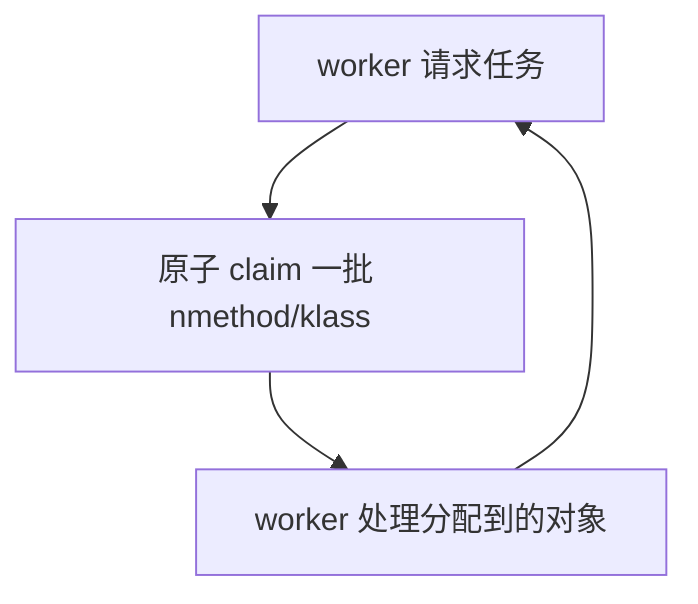

# ParallelCleaning 机制详解

## 一、功能概述

**ParallelCleaning** 是 HotSpot JVM 在 GC（垃圾回收）过程中，为提升类元数据、代码缓存等清理与卸载效率而设计的并行清理基础设施。其核心目标是：

- 利用多线程并行清理 JVM 内部的类元数据（Klass）、代码缓存（nmethod）等结构。
- 支持 GC 并发/并行阶段高效地回收无用类、方法、弱引用等，缩短 STW（Stop-The-World）时间。
- 通过任务分解与原子调度，保证多线程下的正确性与高吞吐。

---

## 二、典型使用场景

- **GC Full GC/并发标记清理阶段**：如 G1、ParallelGC、ZGC、Shenandoah 等在 Full GC 或并发标记清理阶段，需要批量清理无用类、卸载无用 nmethod、清理弱引用等。
- **类卸载（Class Unloading）**：GC 发现无用类后，需并行清理 ClassLoaderDataGraph、InstanceKlass 等元数据结构。
- **代码缓存清理（CodeCache Unloading）**：GC 发现无用 nmethod 后，需并行清理和卸载代码缓存。
- **弱引用清理**：配合 OopStorage 并发遍历，批量清理弱引用表。

---

## 三、源码结构与关键实现

### 1. 主要类与结构

- **CodeCacheUnloadingTask**
  - 管理并行 nmethod（代码缓存）清理与卸载任务。
  - 支持多线程分段 claim nmethod，保证并发安全。
- **KlassCleaningTask**
  - 管理并行类元数据（Klass）清理任务。
  - 支持多线程分段 claim InstanceKlass，清理弱引用等。
- **ClassLoaderDataGraphKlassIteratorAtomic**
  - 支持多线程安全遍历所有 Klass。
- **相关依赖**：OopStorageParState、WorkerThread、ClassLoaderDataGraph、CodeCache 等。

### 2. 关键成员与方法

#### CodeCacheUnloadingTask

- `CodeCacheUnloadingTask(uint num_workers, bool unloading_occurred)`
  - 构造函数，初始化并行任务。
- `void work(uint worker_id)`
  - 每个 GC worker 线程调用，分段 claim nmethod 并清理。
- `void claim_nmethods(nmethod** claimed_nmethods, int *num_claimed_nmethods)`
  - 原子分配一批 nmethod 给当前 worker。

#### KlassCleaningTask

- `KlassCleaningTask()`
  - 构造函数，初始化并行任务。
- `void work()`
  - 每个 GC worker 线程调用，分段 claim InstanceKlass 并清理。
- `bool claim_clean_klass_tree_task()`
  - 原子分配清理任务。
- `InstanceKlass* claim_next_klass()`
  - 原子分配下一个 InstanceKlass。
- `void clean_klass(InstanceKlass* ik)`
  - 清理单个类的弱引用等。

---

## 四、典型使用流程图

### 1. 并行 nmethod 清理流程

```mermaid
flowchart TD
    A[GC 触发 CodeCacheUnloadingTask] --> B[初始化 nmethod 列表]
    B --> C[GC worker 线程并发调用 work()]
    C --> D{claim_nmethods}
    D -- 有剩余 --> E[清理/卸载 nmethod]
    E --> D
    D -- 无剩余 --> F[worker 结束]
```

### 2. 并行 Klass 清理流程

```mermaid
flowchart TD
    A[GC 触发 KlassCleaningTask] --> B[初始化 ClassLoaderDataGraphKlassIteratorAtomic]
    B --> C[GC worker 线程并发调用 work()]
    C --> D{claim_next_klass}
    D -- 有剩余 --> E[clean_klass(ik)]
    E --> D
    D -- 无剩余 --> F[worker 结束]
```

### 3. 任务分配与原子调度



---

## 五、源码实现要点

### 1. 多线程任务分配

- 通过原子变量（如 _claimed_nmethod、_clean_klass_tree_claimed）实现多线程安全的任务分配。
- 每个 worker 线程循环 claim 一批对象，处理后继续 claim，直到全部处理完毕。

### 2. 高效遍历与清理

- 利用 ClassLoaderDataGraphKlassIteratorAtomic 支持多线程安全遍历所有 Klass。
- nmethod 清理采用批量 claim，减少原子操作开销。

### 3. 任务解耦与扩展性

- CodeCacheUnloadingTask、KlassCleaningTask 设计为独立任务类，便于扩展更多并行清理任务（如弱引用、OopStorage 等）。

### 4. 与 GC 框架协作

- 由 GC 框架统一调度 worker 线程，分配并行清理任务，提升 Full GC/STW 阶段吞吐。

---

## 六、设计优势与总结

- **高效并行**：多线程分段 claim，极大提升清理/卸载吞吐，缩短 GC 停顿。
- **原子调度**：任务分配原子化，保证多线程安全与负载均衡。
- **解耦扩展**：任务类独立，便于扩展更多并行清理任务。
- **GC 友好**：与 GC 框架、OopStorage、ClassLoaderDataGraph、CodeCache 等紧密协作。

---

## 七、参考源码位置

- `src/hotspot/share/gc/shared/parallelCleaning.hpp`
- `src/hotspot/share/gc/shared/oopStorageParState.hpp`
- `src/hotspot/share/classfile/classLoaderDataGraph.hpp`
- `src/hotspot/share/code/codeCache.hpp`

---

如需更详细的源码注释、流程细节或特定 GC 场景的深入分析，可进一步指定需求。