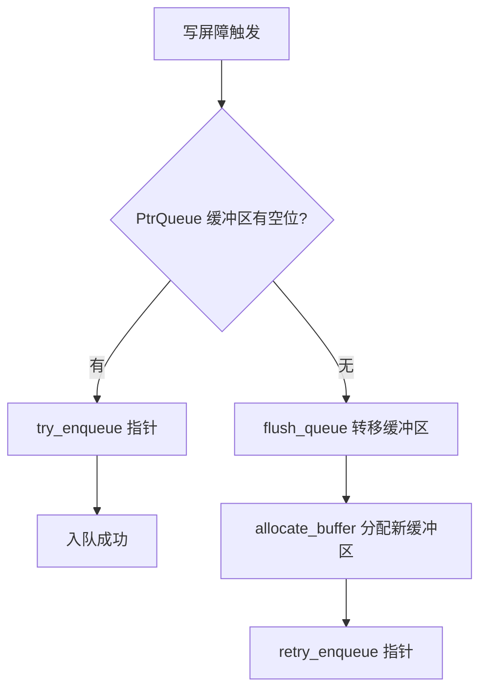
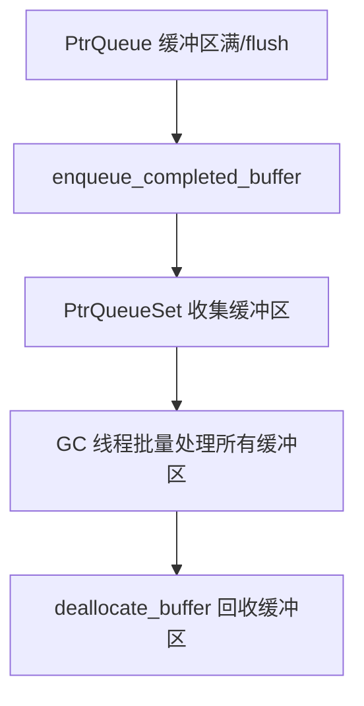
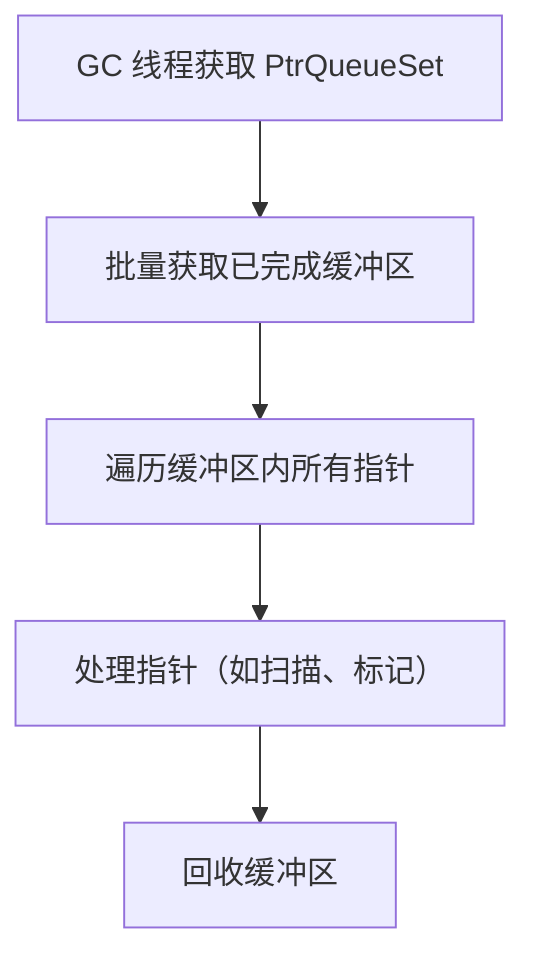

# PtrQueue / PtrQueueSet 机制详解

## 一、功能概述

**PtrQueue** 及 **PtrQueueSet** 是 HotSpot JVM GC 子系统中用于**跨线程、跨阶段传递指针（地址）信息**的高效缓冲队列机制。其核心目标是：

- 为写屏障、卡表、并发 GC 等场景提供高效的“指针日志”缓冲区。
- 支持多线程安全地收集、转移、批量处理指针（如对象地址、卡表地址等）。
- 通过缓冲池、批量回收等手段，减少同步与内存分配开销。

---

## 二、典型使用场景

- **写屏障日志（Card/Remembered Set Logging）**：如 G1、Shenandoah、ZGC 等分代/区域 GC，写屏障将被修改的对象/卡表地址记录到 PtrQueue，GC 线程批量处理。
- **并发 GC Root/引用收集**：如 SATB（Snapshot-At-The-Beginning）等并发标记算法，mutator 线程将 root/引用变更通过 PtrQueue 传递给 GC。
- **跨线程任务传递**：GC 线程间、mutator 与 GC 线程间通过 PtrQueueSet 共享和转移指针缓冲区。
- **批量处理优化**：通过缓冲池和批量回收，减少频繁分配和同步。

---

## 三、源码结构与关键实现

### 1. 主要类与结构

- **PtrQueue**
  - 单个线程/组件持有的指针缓冲队列，支持入队、出队、缓冲区切换等操作。
  - 关键成员：_buf（缓冲区）、_index（当前入队位置）、current_capacity（容量）。
- **PtrQueueSet**
  - 管理一组 PtrQueue 的资源池，负责缓冲区分配、回收、批量转移等。
  - 关键成员：_allocator（缓冲区分配器）、allocate_buffer/deallocate_buffer。
- **BufferNode/BufferNode::Allocator**
  - 实现缓冲区的分配与回收，支持批量管理。

### 2. 关键成员与方法

#### PtrQueue

- `PtrQueue(PtrQueueSet* qset)`：构造函数，注册到队列集。
- `~PtrQueue()`：析构，需保证队列已 flush。
- `bool try_enqueue(void* value)`：尝试将指针入队，缓冲区满时返回 false。
- `void retry_enqueue(void* value)`：缓冲区扩容后重试入队。
- `void set_buffer(void** buffer)`：设置缓冲区。
- `void flush_queue()`：将缓冲区内容转移到队列集，或回收缓冲区。
- `bool is_empty()` / `size_t size()`：判断队列是否为空/已用元素数。
- `size_t current_capacity()`：缓冲区容量。

#### PtrQueueSet

- `void** allocate_buffer()` / `void deallocate_buffer(BufferNode* node)`：分配/回收缓冲区。
- `void enqueue_completed_buffer(BufferNode* node)`：将已满/已用缓冲区转移到队列集，供 GC 线程批量处理。
- `void flush_queue(PtrQueue& queue)`：将队列内容转移到队列集。
- `size_t buffer_capacity()`：缓冲区标准容量。

---

## 四、典型使用流程图

### 1. 写屏障日志入队流程

### 2. 缓冲区转移与批量处理流程

### 3. GC 线程批量消费流程

---

## 五、源码实现要点

### 1. 高效缓冲与批量转移

- 每个线程独立持有 PtrQueue，减少同步。
- 缓冲区满时批量转移到 PtrQueueSet，GC 线程批量消费，提升吞吐。

### 2. 缓冲池与内存复用

- PtrQueueSet 统一管理缓冲区分配与回收，减少频繁分配/释放带来的开销。
- 支持缓冲区复用，提升内存利用率。

### 3. 灵活扩展与适配

- 支持不同类型的指针日志（如对象地址、卡表地址等）。
- 可扩展为多种 GC/屏障/并发算法的日志缓冲基础设施。

### 4. 线程安全与性能优化

- 通过原子操作、批量转移、缓冲池等手段，兼顾线程安全与高性能。

---

## 六、设计优势与总结

- **高效批量**：缓冲区机制大幅提升指针日志收集与处理效率。
- **线程隔离**：每线程独立队列，减少锁竞争。
- **内存复用**：缓冲池统一管理，降低分配/回收成本。
- **GC 友好**：与写屏障、并发 GC、卡表等机制紧密协作。
- **灵活适配**：可服务于多种 GC、屏障、并发算法。

---

## 七、参考源码位置

- `src/hotspot/share/gc/shared/ptrQueue.hpp`
- `src/hotspot/share/gc/shared/ptrQueue.cpp`
- `src/hotspot/share/gc/shared/bufferNode.hpp`

---

如需更详细的源码注释、流程细节或特定 GC/屏障场景的深入分析，可进一步指定需求。