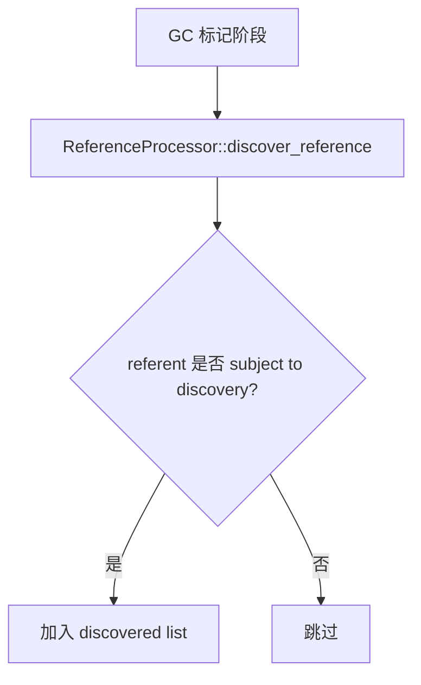
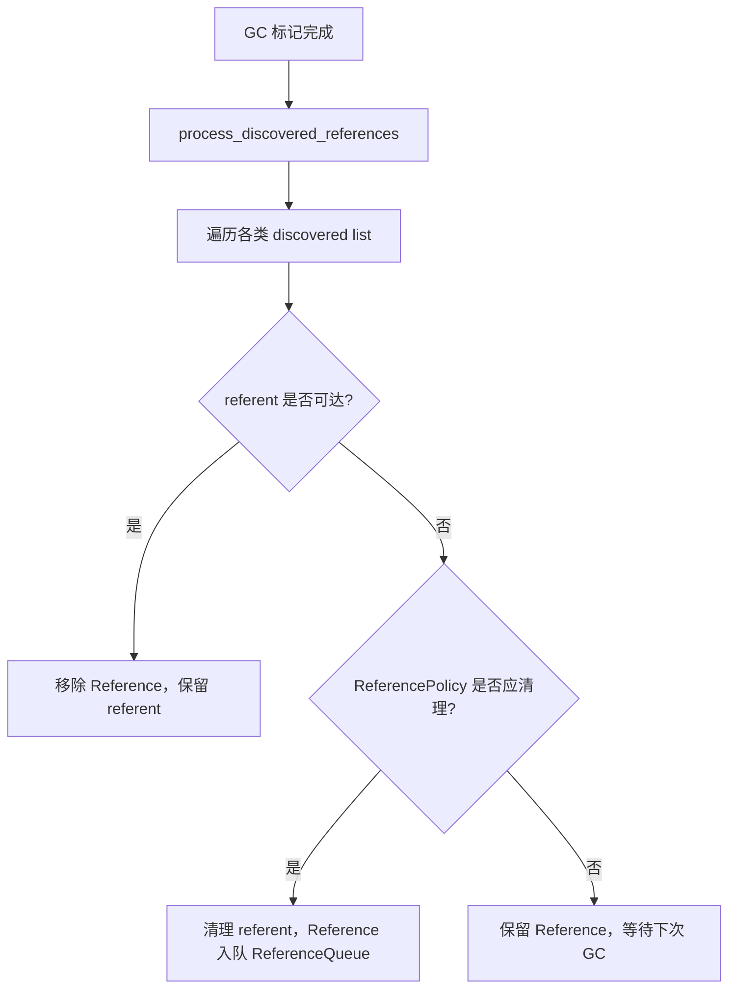
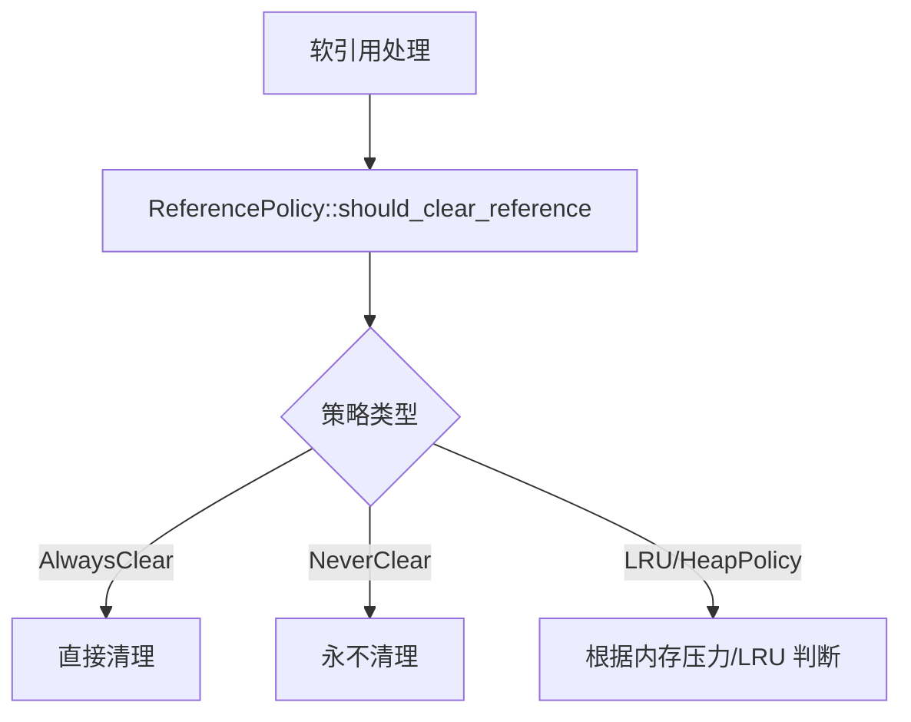
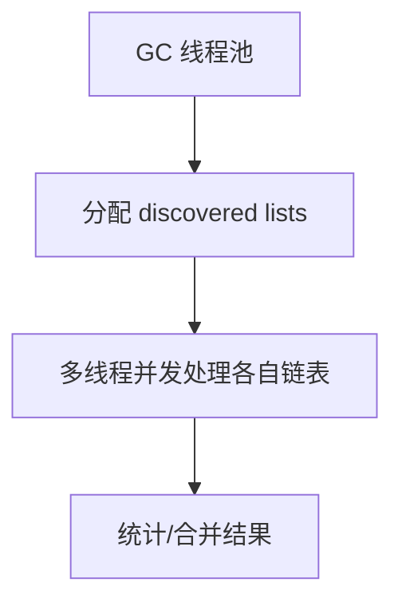

# ReferenceProcessor 及弱引用处理机制详解

## 一、功能概述

**ReferenceProcessor** 是 HotSpot JVM 中专门负责管理和处理 Java 弱引用（SoftReference、WeakReference、FinalReference、PhantomReference）生命周期的核心组件。其主要目标是：

- 在 GC 过程中发现、分离、处理各种 Reference 对象，决定其 referent 是否可达、是否需要清理或保留。
- 支持多线程、并发、分代等多种 GC 场景下的高效弱引用处理。
- 提供灵活的软引用回收策略（ReferencePolicy），支持不同 GC 策略和内存压力下的自适应行为。
- 统计和监控弱引用处理的各类指标，便于调优和分析。

---

## 二、典型使用场景

- **GC 标记-清理/压缩阶段**：在 GC 标记完成后，ReferenceProcessor 负责遍历所有 Reference 对象，判断 referent 是否可达，并根据策略决定是否清理、保留或进入 ReferenceQueue。
- **软引用缓存管理**：通过 ReferencePolicy 支持 LRU、AlwaysClear、NeverClear 等多种软引用回收策略，适应不同内存压力。
- **Finalizer 管理**：FinalReference 处理对象终结，确保 finalize() 被正确调用。
- **PhantomReference 清理**：在对象不可达后，PhantomReference 用于资源回收的最后通知。
- **多线程/并发 GC**：支持多线程发现、处理和清理弱引用，提升 GC 吞吐。

---

## 三、源码结构与关键实现

### 1. 主要类与结构

- **ReferenceProcessor**
  - 弱引用发现、分离、处理的核心类，支持多线程、分代、并发等多种模式。
  - 管理 discovered lists、ReferencePolicy、并发/多线程参数等。
- **ReferencePolicy**
  - 软引用回收策略基类，支持 LRU、AlwaysClear、NeverClear 等多种策略。
- **ReferenceDiscoverer**
  - 弱引用发现接口，ReferenceProcessor 作为其实现。
- **DiscoveredList / DiscoveredListIterator**
  - 管理和遍历已发现的 Reference 对象链表。
- **ReferenceProcessorStats / ReferenceProcessorPhaseTimes**
  - 统计和记录弱引用处理的各类指标和阶段耗时。

### 2. 关键成员与方法

#### ReferenceProcessor

- `discover_reference(oop obj, ReferenceType type)`：发现并分离 Reference 对象，加入 discovered list。
- `process_discovered_references(...)`：主处理流程，遍历 discovered lists，判断 referent 是否可达，决定清理/保留/入队。
- `preclean_discovered_references(...)`：GC 并发阶段预清理，提前移除可达 referent。
- `enable_discovery()/disable_discovery()`：控制弱引用发现开关。
- `set_is_subject_to_discovery_closure(...)`：设置发现判定闭包，支持分代/区域 GC。
- `abandon_partial_discovery()`：放弃本轮发现，清空 discovered lists。
- `total_reference_count(ReferenceType rt)`：统计各类 Reference 数量。

#### ReferencePolicy

- `should_clear_reference(oop p, jlong timestamp_clock)`：判断软引用是否应被清理。
- `setup()`：捕获当前 VM 状态，辅助策略决策。

#### DiscoveredList/DiscoveredListIterator

- 管理和遍历已发现的 Reference 链表，支持并发/多线程处理。

#### ReferenceProcessorStats/ReferenceProcessorPhaseTimes

- 记录各类 Reference 处理数量、各阶段耗时、队列平衡等统计信息。

---

## 四、典型使用流程图

### 1. 弱引用发现与分离流程

### 2. 弱引用处理主流程

### 3. 软引用回收策略决策流程

### 4. 多线程/并发处理流程

---

## 五、源码实现要点

### 1. 多线程与分代支持

- 支持多 discovered list，GC 线程并发处理，提升吞吐。
- 通过 is_subject_to_discovery_closure 支持分代/区域 GC 的发现判定。

### 2. 策略灵活

- ReferencePolicy 支持多种软引用回收策略，便于适应不同 GC/内存压力场景。

### 3. 统计与监控

- ReferenceProcessorStats/PhaseTimes 记录各类 Reference 处理数量、各阶段耗时，便于调优和分析。

### 4. 兼容并发/串行 GC

- 支持并发发现、处理，兼容串行和并发 GC 场景。

---

## 六、设计优势与总结

- **高效分离与处理**：弱引用分离、处理与普通对象分开，提升 GC 精度与效率。
- **灵活策略**：软引用策略可调，适应不同内存压力和业务需求。
- **多线程并发**：支持多线程发现与处理，提升大堆 GC 吞吐。
- **统计与监控**：丰富的统计与阶段耗时，便于性能分析和调优。
- **GC 友好**：与 GC 框架、ReferenceQueue、Finalizer 等紧密协作。

---

## 七、参考源码位置

- `src/hotspot/share/gc/shared/referenceProcessor.hpp`
- `src/hotspot/share/gc/shared/referenceProcessor.inline.hpp`
- `src/hotspot/share/gc/shared/referencePolicy.hpp`
- `src/hotspot/share/gc/shared/referenceDiscoverer.hpp`
- `src/hotspot/share/gc/shared/referenceProcessorStats.hpp`
- `src/hotspot/share/gc/shared/referenceProcessorPhaseTimes.hpp`

---

如需更详细的源码注释、流程细节或特定 GC/弱引用场景的深入分析，可进一步指定需求。