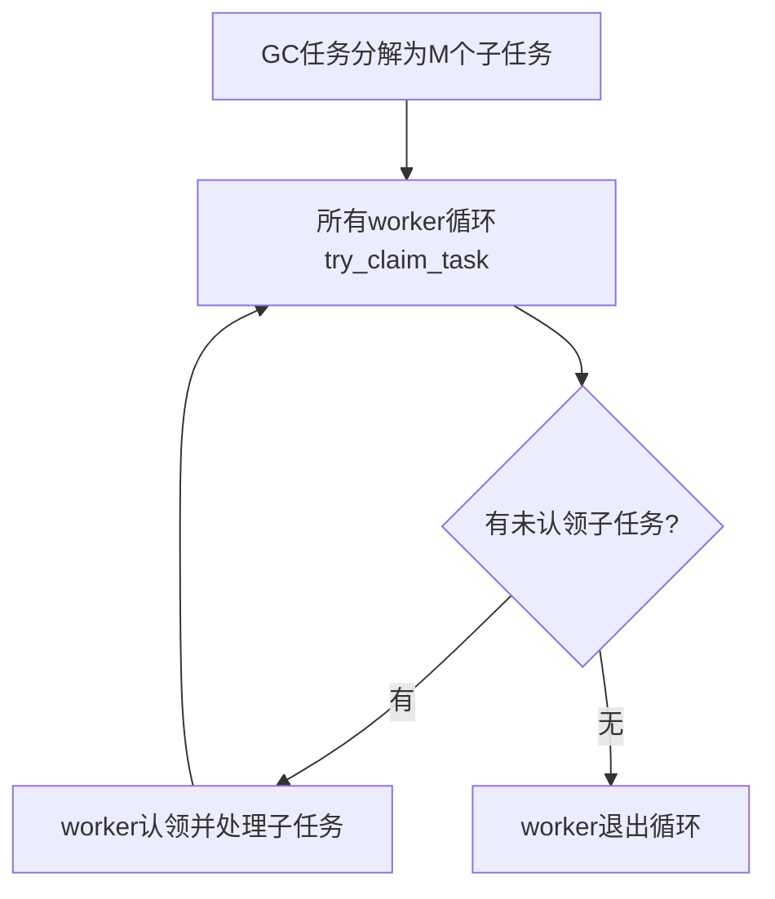
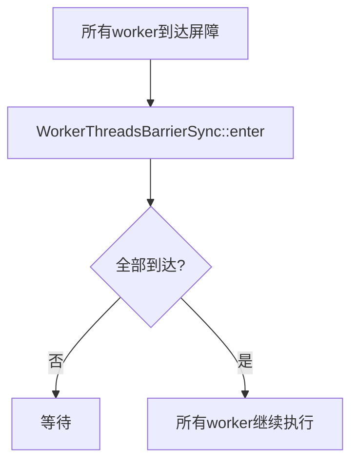

# WorkerPolicy / WorkerThreads / WorkerTask 并行GC线程池与任务调度机制详解

## 一、功能概述

这些类和工具共同构成了 HotSpot JVM 并行/并发 GC 线程池的**线程管理、任务分发与并行协作**基础设施。其核心目标是：

- 动态决定并行GC线程数，适应不同硬件/负载。
- 高效管理GC worker线程的生命周期与任务分发。
- 支持多种GC阶段的并行任务调度与同步。
- 提供任务分解、子任务认领、线程屏障等并行协作工具。

---

## 二、典型使用场景

- **并行GC（如ParallelGC、G1、Shenandoah、ZGC）**：GC各阶段（如对象复制、标记、清理、引用处理等）通过WorkerThreads池并发执行任务。
- **Full GC/Young GC/并发标记等多阶段任务**：不同GC阶段可动态调整活跃worker数，提升资源利用率。
- **GC子任务分解与认领**：如分区扫描、卡表处理、引用处理等，支持细粒度任务分解与动态负载均衡。
- **GC线程间同步与屏障**：如阶段性同步、任务完成等待等。

---

## 三、源码结构与关键实现

### 1. 主要类与结构

- **WorkerPolicy**
  - 静态工具类，负责根据硬件/配置/负载动态计算并行GC线程数。
- **WorkerThreads**
  - GC worker线程池，负责线程创建、管理、任务分发与同步。
- **WorkerThread**
  - 单个GC worker线程，负责执行分配的任务。
- **WorkerTask**
  - GC任务基类，所有并行GC任务需继承并实现work(worker_id)。
- **WorkerTaskDispatcher**
  - 任务分发器，协调任务分发与线程同步。
- **WorkerUtils（WorkerThreadsBarrierSync、SubTasksDone、SequentialSubTasksDone）**
  - 并行协作工具，支持线程屏障、子任务认领、顺序任务分解等。

### 2. 关键成员与方法

#### WorkerPolicy

- `static uint parallel_worker_threads()`：返回当前应使用的并行GC线程数。
- `static uint calc_active_workers(...)`：根据GC阶段/负载动态计算活跃worker数。
- `static uint calc_active_conc_workers(...)`：并发阶段worker数计算。

#### WorkerThreads

- `WorkerThreads(const char* name, uint max_workers)`：构造线程池。
- `void initialize_workers()`：初始化所有worker线程。
- `void run_task(WorkerTask* task, uint num_workers)`：分发任务到指定数量worker并等待完成。
- `uint set_active_workers(uint num_workers)`：设置本轮活跃worker数。
- `threads_do(ThreadClosure*)`：遍历所有worker线程。

#### WorkerThread

- `void run()`：主循环，等待任务分发并执行。
- `static uint worker_id()`：获取当前线程worker编号。

#### WorkerTask/WorkerTaskDispatcher

- `virtual void work(uint worker_id)`：worker线程执行的任务入口。
- `void coordinator_distribute_task(WorkerTask* task, uint num_workers)`：协调分发任务并等待所有worker完成。

#### WorkerUtils

- **WorkerThreadsBarrierSync**：线程屏障，所有worker到达后方可继续。
- **SubTasksDone**：支持子任务认领，适合枚举型任务分解。
- **SequentialSubTasksDone**：顺序子任务认领，适合动态分区任务。

---

## 四、典型使用流程图

### 1. GC任务分发与执行流程

```mermaid
flowchart TD
    A[GC控制器] --> B[WorkerThreads::run_task(task, N)]
    B --> C[WorkerTaskDispatcher::coordinator_distribute_task]
    C --> D[worker线程等待任务]
    D --> E[worker线程收到任务, 执行work(worker_id)]
    E --> F[worker线程完成, 通知dispatcher]
    F --> G[所有worker完成, 控制器继续]
```

### 2. 子任务认领与并行协作流程



### 3. 线程屏障同步流程



---

## 五、源码实现要点

### 1. 动态线程数与资源利用

- WorkerPolicy根据CPU核数、GC阶段、负载等动态调整并行GC线程数，兼顾吞吐与资源利用。
- 支持GC不同阶段（如并发/串行/Full GC）灵活切换worker数。

### 2. 高效任务分发与同步

- WorkerTaskDispatcher基于信号量实现高效任务分发与同步，避免忙等。
- WorkerThreads支持任务分发、线程遍历、活跃worker动态调整。

### 3. 子任务认领与负载均衡

- SubTasksDone/SequentialSubTasksDone支持细粒度任务分解与动态认领，提升负载均衡与并行效率。

### 4. 线程屏障与协作

- WorkerThreadsBarrierSync实现高效线程屏障，适合阶段性同步。

---

## 六、设计优势与总结

- **高效并行**：多线程GC任务分发与协作，极大提升GC吞吐。
- **动态自适应**：线程数、任务分解、同步机制均可动态调整，适应不同硬件与GC负载。
- **灵活扩展**：支持多种GC、不同阶段、不同任务类型的并行调度。
- **易于维护与监控**：线程池、任务、屏障、子任务等结构清晰，便于监控与调优。

---

## 七、参考源码位置

- `src/hotspot/share/gc/shared/workerPolicy.hpp`
- `src/hotspot/share/gc/shared/workerThread.hpp`
- `src/hotspot/share/gc/shared/workerUtils.hpp`

---

如需更详细的源码注释、流程细节或特定GC/并行任务场景的深入分析，可进一步指定需求。