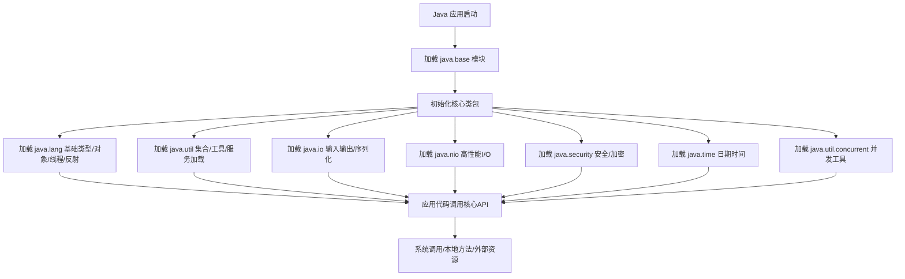

# java.base模块详解

---

## 1. 功能综述

`java.base` 是JDK的根模块，定义了Java SE平台的基础API。它包含了Java语言运行所需的所有核心类库，是所有Java程序和其它模块的基础。

- 提供对象、字符串、集合、I/O、NIO、并发、反射、安全、时间日期等核心功能。
- 任何Java程序都隐式依赖`java.base`，无需在`module-info.java`中声明。
- 该模块的API设计遵循高性能、高兼容性和安全性。

---

## 2. 主要使用场景

- **所有Java应用**：无论是控制台、Web、桌面、移动还是服务端应用，都依赖`java.base`。
- **基础开发**：字符串处理、集合操作、文件与网络I/O、并发控制、加密解密、反射、异常处理等。
- **JVM自身实现**：JVM启动、类加载、模块系统、系统属性、线程调度等。

---

## 3. 源码结构与核心内容

`java.base`模块源码主要分布在如下包中：

### 3.1 java.lang
- **Object**：所有类的根基。
- **String**、**StringBuilder**、**StringBuffer**：字符串处理。
- **System**、**Runtime**、**Process**、**Thread**、**ThreadLocal**：系统、进程、线程管理。
- **Class**、**ClassLoader**、**reflect**：类与反射机制。
- **Throwable**、**Exception**、**Error**：异常体系。
- **Math**、**StrictMath**、**Number**、**Integer**、**Double**等：数学与数值类型。

### 3.2 java.util
- **Collection**、**List**、**Set**、**Map**、**Queue**：集合框架。
- **Arrays**、**Objects**、**Collections**：集合与对象工具类。
- **Optional**、**ServiceLoader**、**Properties**、**ResourceBundle**：工具与服务加载。

### 3.3 java.io
- **InputStream**、**OutputStream**、**Reader**、**Writer**：基础I/O流。
- **File**、**RandomAccessFile**、**Serializable**、**ObjectInputStream**、**ObjectOutputStream**：文件与对象序列化。

### 3.4 java.nio
- **Buffer**、**ByteBuffer**、**CharBuffer**：高性能缓冲区。
- **file**、**channels**、**charset**：NIO文件、通道、字符集支持。

### 3.5 java.util.concurrent
- **Executor**、**ExecutorService**、**Future**、**ThreadPoolExecutor**、**ConcurrentHashMap**、**CountDownLatch**、**Semaphore**、**CompletableFuture**等：并发工具与线程池。

### 3.6 java.security
- **MessageDigest**、**Signature**、**KeyStore**、**SecureRandom**、**AccessController**等：安全、加密、权限控制。

### 3.7 java.time
- **LocalDate**、**LocalTime**、**LocalDateTime**、**Instant**、**Duration**、**Period**等：现代日期时间API。

---

## 4. 典型使用流程图

---

## 5. 小结

- `java.base`模块是Java平台的基石，涵盖了绝大多数Java开发的基础能力。
- 其源码结构清晰，包内类职责分明，便于查阅和学习。
- 理解`java.base`有助于深入掌握Java语言和JDK整体架构。